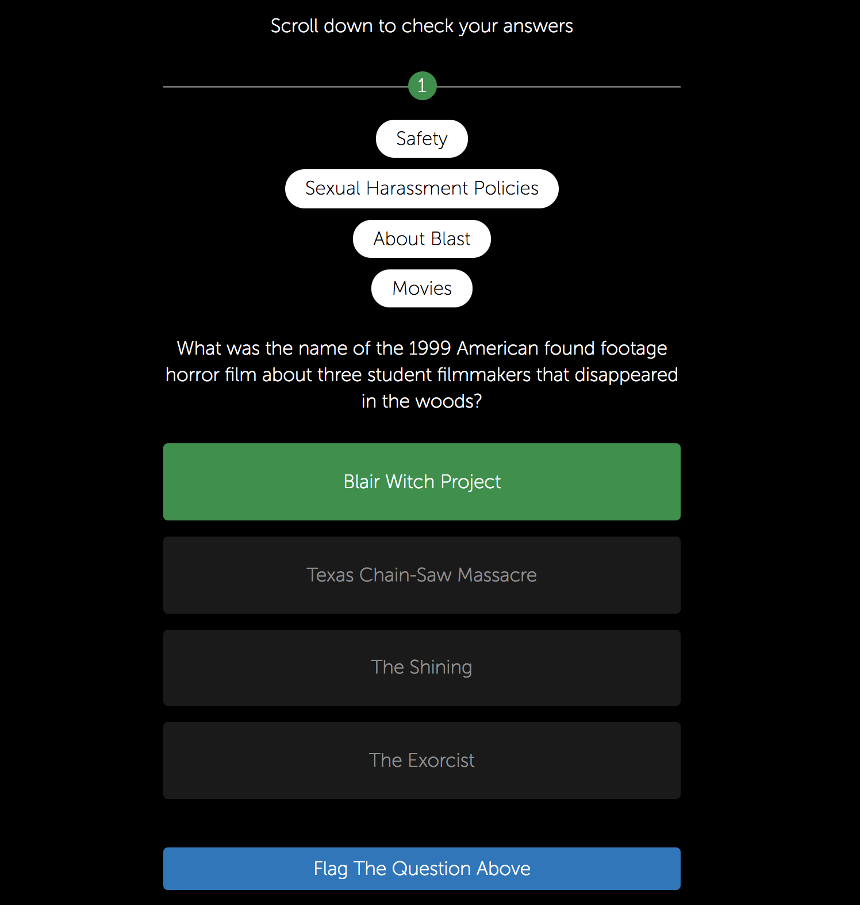
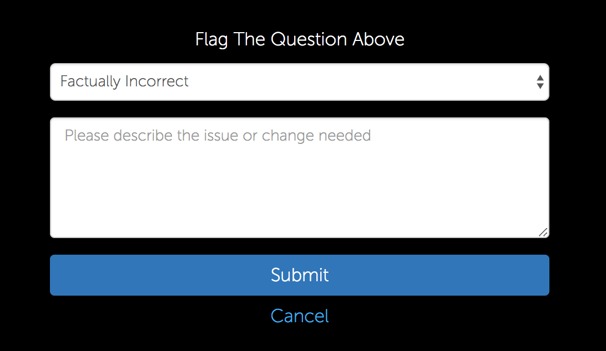
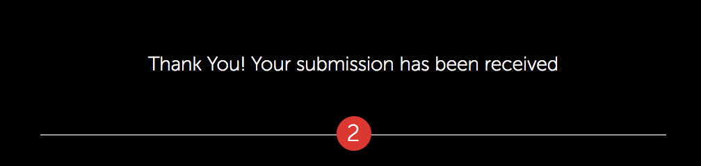

# Flag a Question

Our application included a quiz game built in React. Whenever a user completed
a quiz they could review their answers. To solve the problem of keeping up the
integrity of content we added a feature where a user could send us feedback
on questions they felt were incorrect or that contained any grammatical errors.

### Architecture

The `QuestionComplaintForm.jsx`  is a container component and was utilized in 
the quiz review view (not included). This component houses the state and logic
needed to render the correct presentational component (`OpenQuestionComplaintForm.jsx`
or `ClosedQuestionComplaintForm.jsx`) and the functions needed to collect and
submit data from the form to our backend. 

### Images

